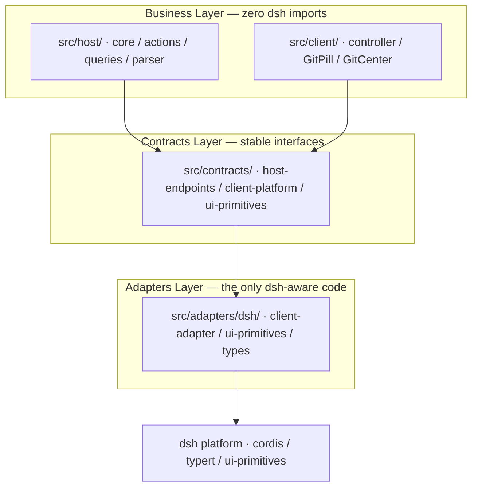

# dsh-git-ui

[](https://www.npmjs.com/package/dsh-git-ui)
[](https://www.npmjs.com/package/dsh-git-ui)
[](https://www.npmjs.com/package/dsh-git-ui)

A [DeepSeek Harness](https://github.com/deepseek-ai/deepseek-harness) (dsh) plugin that visualizes Git status in the Web UI — the session-header pill shows the current branch (or detached HEAD) and dirty-state counts (staged / modified / untracked) with ahead/behind at a glance. Click for recent commits and changed files, or open the Git center for full management. No terminal needed.

> Read this in [简体中文](README.zh.md).

- 📦 **npm**: <https://www.npmjs.com/package/dsh-git-ui>
- 🐙 **GitHub**: <https://github.com/Julyves/dsh-git-ui>
- 🐛 **Issues**: <https://github.com/Julyves/dsh-git-ui/issues>

## Features

- **Branch pill** in the session header (right-aligned, per-session): a status dot (green when clean, orange when dirty) followed by the branch name and dirty / ahead-behind badges — click to open the detail popover:

  

  | State | Pill |
  |---|---|
  | Clean | `● main` |
  | Dirty | `● main · +2 −1 ?3` |
  | Ahead / behind | `● main · ↑1 ↓2` |
  | Detached HEAD | `● (detached HEAD) · a1b2c3d` |
  | Unborn (no commits) | `● main · 无提交` |
  | Not a git repo | Dimmed `无 Git 仓库` |
  | Git unavailable / error | Dimmed `Git 不可用` (reason in tooltip) |

  `+N −N ?N` = staged / modified / untracked; `↑N ↓N` = ahead / behind. When both dirty and ahead/behind, the badges combine (e.g. `● main · +2 −1 ?3 · ↑1 ↓2`).

- **Detail popover** (click the pill): repository root, status counts (staged / modified / untracked) with dirty and ahead/behind badges, recent commits (hash · subject · author · relative time), a changed-file list with status chips and inline per-file actions (stage / unstage / discard), an inline branch switcher, a manual refresh button, and last-checked time:

  

- **Git center** (management panel opened from the popover): four tabs — **Changes**, **History**, **Records** and **Settings**.
  - *Changes*: IDE-style grouped lists (staged / unstaged / untracked), per-file and bulk stage / unstage / discard (two-step confirm), a commit box (selected files or everything staged), and an inline side-by-side diff for the selected file with prev/next navigation.
  - *History*: a paginated commit list with a rendered branch graph, per-commit details (subject · body · changed-file tree), and filters by branch / tag / author / date / text-or-hash, plus a fetch-remote button.
  - *Records*: the turn work-record session timeline — see the [Turn work records](#turn-work-records) section below.
  - *Settings*: **configurable pill information components** — a live preview, four display presets (minimal / standard / full / custom, purely derived so any manual tweak snaps back when it matches a preset again), and per-component switches (status dot, branch name, the three change-count badges, ahead/behind; plus popup blocks: repository path, status bar, branch switcher, new-branch row, recent-commit count, changed-file list). Also reachable via the gear icon in the popup header:

- **Polished diff viewer** (Changes tab side-by-side):
  - **New files shown directly**: a pure-add diff (`--- /dev/null` shape) no longer renders an empty comparison column — the created file's full content is displayed single-column with line numbers; 0-byte empty files show "file is empty" instead of a meaningless empty diff.
  - **Syntax highlighting**: per file type (shiki TextMate grammars, JS regex engine — no WASM) with keyword/string/comment/number coloring; the whole file is tokenized once and rendered line-by-line, so multi-line comments and strings stay correct. Colors reuse the host theme's `--shiki-*` tokens (auto light/dark); the highlight switch and code font size are configurable. The language subset and approximation mapping (C++→C, HTML→XML, SCSS/LESS→CSS) under the bundle budget are listed under [Known Limitations](#known-limitations).
  - **Context folding**: runs of 12+ unchanged lines collapse into an expandable "… N unchanged lines" strip (click to expand/collapse); can be disabled in settings.
  - **Bug fix**: the `\ No newline at end of file` marker no longer shifts line-number alignment.
  - **Settings**: a diff-viewer group — code font size (10–16px), syntax-highlight switch, context-folding switch; independent of the display presets (adjusting them does not flip the preset back to "custom").

- **Settings persisted on the host disk (v2)**: settings no longer live in localStorage — they are stored under the dsh Harness home at `plugin-data/dsh-git-ui/settings.json` (`$DSH_HOME` → `~/.dsh`, overridable via `dshHome` in the profile config), written atomically (temp file + rename) and surviving restarts across devices. The browser only reads/writes through host RPC (strict file-name whitelist); on initialization, v1 localStorage settings are migrated once to disk (the key is not read anymore afterwards).
- **Turn work records**: per-turn attribution of file-system changes, strictly git-based (ignored / out-of-repo files never count). Two modes:
  - **Single-turn mode (pill, default)**: the pill leads with an incremental unread badge (`new N` since your last view — opening the popup or Records tab clears it), then three-way authorship counts — `in` (this session's agent, subagents included) / `sib` (AI of other dsh sessions in the same workspace) / `ext` (human: IDE, terminal, unknown). Click the pill for the grouped file lists and the task narrative; the switch in Settings hides the badge.
  - **All-session mode (Records tab in the Git center)**: consecutive working turns are merged into **working sessions** (default 10-minute gap) — a single-column session-card timeline: each card header shows the **task narrative** (the user instruction driving that period — "what" before "when"), the time window, and three-way counts, expanding into three file groups (this session / other sessions / external) with state badges (still dirty / committed / reverted / left); the toolbar offers a summary (sessions · files · dirty) and a four-way filter. **Every period is expandable** — periods that produced no file changes carry a dimmed "no changes" chip on the header and show an empty-state note when opened, so "did this turn touch anything?" is answered at a glance.
  - **Three-way authorship**: `this session` / `other sessions` (AI writing in the same workspace) / `external` (human) — the attribution axis now matches the user's mental model: "AI changed it" vs "I changed it" no longer share one bucket.
  - **Action loop**: each session card offers **bulk staging** — "Stage AI changes" (this + other sessions' dirty files, human WIP excluded) and "Stage all"; **committed entries deep-link to the exact commit** in the History tab (hash carried by the same HEAD-detection git command, zero extra runs).
  - **Attribution confidence + manual correction**: entries backed by platform-declared write intent (diff cards / write-kind cards / result meta) render as solid badges; heuristic ones (bash static targets / args fallback / time-window attribution) get a dashed badge with `≈` — the error is visible. Hover an entry and press `⇄` to reclassify its authorship (persisted per repository under `plugin-data/dsh-git-ui/overrides.json`; applied uniformly across popup, Records tab, and unread counts).
  - **Checkpoint foundation (turn-boundary fingerprints)**: each snapshot idempotently captures the latest turn's boundary change-set (`fp-<session>.jsonl`, restored across restarts); entries absent from the *previous* turn's fingerprint are marked `new`. Content-level snapshots and per-turn rollback remain the endgame, not yet provided.
  - **How it works**: the host folds the session event log (`turn/start`·`turn/end`·`tool/call`·`user/message` timestamps) into exact per-turn windows plus task narratives (recovered from `narr-<session>.jsonl` after compaction), extracts agent-written paths by reusing each tool's own `presentCall` write intent (bash gets a static-target heuristic: redirects / tee / sed -i / cp-mv / dd of=), merges other-session writes by enumerating same-cwd sessions (zero git commands), and attributes external changes through a polling observation timeline (first-seen per path, HEAD-move commit detection — `--format=%H` carries the commit hash on the same command for deep links — and mtime refinement for still-dirty files). The observation timeline is persisted under `plugin-data/dsh-git-ui/obs-<session>.jsonl` (atomic writes, reconciled against commits on restore), so records survive host restarts. **L3 seam**: `TurnRecordSources.filesWritten` — when the upstream sandbox provides per-turn authoritative write sets, the whole heuristic pipeline is bypassed for those turns.

  Every operation refreshes the status instantly:

  

  

  

- **Always-fresh data, zero interaction**: automatic status snapshot on session open, silent polling (host-configured interval, default 30s, no overlapping requests), **immediate refresh when an agent turn completes** (best-effort — the working tree most likely changed right then), resync after reconnect, and a manual refresh button.
- **Deterministic degradation**: non-git directories, missing cwd, missing git, timeouts, and oversized repositories show stable fallback states — never crashes, never spams.
- **Zero agent impact**: adds no model tools and writes no session events — it never changes agent behavior. Git operations in the center (stage / commit / branch / fetch) are user-initiated from the UI, never agent-driven.

## Installation

Requires a running [DeepSeek Harness](https://github.com/deepseek-ai/deepseek-harness) (dsh) with the `web` profile.

```sh
# Install from the npm registry.
dsh plugin --profile web add dsh-git-ui
```

Restart dsh web. Open a session in a git repository and the branch pill appears in the session header.

To verify the install:

```sh
cat ~/.dsh/profiles/web/package.json   # dsh.profile.bundles should list dsh-git-ui
```

To remove:

```sh
dsh plugin --profile web remove dsh-git-ui
```

> Local development install (links this repo into the profile instead):
> `dsh plugin --profile web add ./`. Local tarball / link installs
> (`file:...tgz`, `github:...`) symlink the package outside the profile tree,
> so its `@deepseek-ai/*` peer dependencies (provided by the host
> installation) are not reachable by Node's resolution. Keep the dev peer
> symlinks in this repo's `node_modules/@deepseek-ai/*`
> (see [Development](#development)) whenever installing locally.

## Usage

1. Open a session whose working directory is inside a git repository.
2. Read the branch pill in the header at any time — no action needed.
3. Click the pill to inspect repository root, counts, recent commits, and changed files; use `刷新` (refresh) for an immediate re-check, or open the Git center for full change management and history.

Each session shows the Git status of **its own working directory**. Non-repository sessions show a dimmed placeholder instead of the pill.

## Configuration (optional)

All defaults work out of the box. Advanced users may override the plugin config in the profile's `cordis.patch.yml` (a later layer wins; the row replaces the whole `config`):

```yaml
- id: git-ui
  config:
    defaultRefreshIntervalMs: 60000   # polling interval (ms); 0 disables polling
    maxChanges: 200                   # max changed-file entries in a snapshot
    timeoutMs: 3000                   # per git-command timeout (ms)
    maxStatusBytes: 8388608           # status-output cap before truncation
    dshHome: /path/to/harness-home    # optional: Harness home (default $DSH_HOME → ~/.dsh)
                                      # plugin data lives under <home>/plugin-data/dsh-git-ui/
```

## Requirements

- Node.js `^22.19.0 || >=24.0.0`
- dsh `>= 0.1.0-rc` (developer preview)
- `git` on the host machine (the plugin shells out to `git`)

## Known Limitations

- Shows the Git state of the session's working directory only. The History filter tree lists remote branches with ahead/behind and a manual fetch, but push / pull / merge are not exposed.
- Polling-based refresh (default 30s); file-watcher event push is a planned extension.
- Changed-file list is capped (`maxChanges`); untracked-directory contents are enumerated individually. When status output overflows the in-memory cap (default 4 MiB) it is recovered from a private spill file so counts stay exact — only if the spill cap (64 MiB) also overflows does the snapshot fall back to approximate (`truncated: true`).
- Browser never sends paths — only a `sessionId`; the host resolves the authoritative cwd and runs git commands (write operations use `--` path separation and reject absolute / `..` escapes).
- Syntax highlighting ships a bundle-budget language subset (TypeScript/JS family, JSON/YAML/TOML/INI, Markdown, XML/HTML, CSS/SCSS/LESS, Python, Shell, Java, Go, Rust, C, C#, Kotlin, SQL, Makefile). C++ is approximated with the C grammar, HTML with XML, and SCSS/LESS with CSS (core tokens correct; language-specific constructs fall back to plain text); unregistered languages such as PHP, Swift, Ruby and Lua fall back to plain text wholesale (still monospace, never an error).
- **Turn work records**: bash writes with dynamically-constructed targets (`$(...)`, globs, `find -exec`, `eval`) are not statically extractable and fall back to external with a visible `≈` inferred mark (the root fix is the L3 `filesWritten` seam, pending an upstream sandbox). Cold (unloaded) subagent / sibling sessions are skipped for their attribution — sibling attribution is frozen into the observation timeline (already-judged entries never drift after the session leaves or the host restarts), but sibling writes **never judged by any query** (the sibling wrote and left between two queries) still land in external; sibling-session detection resolves cwd through realpath and includes subdirectories of the repo (realpath failure degrades to exact match); the observation timeline is capped (2 000 paths/session, oldest pruned) and external changes that appear and vanish within one poll interval cannot be reconstructed after a host restart; turn-boundary fingerprints approximate the boundary at first observation (write-then-revert within one poll interval is indistinguishable); changes predating the first turn have no owning window; manual authorship overrides are repository-scoped (they outlive sessions and are never garbage-collected with them).
- After the v2 storage migration, settings no longer write to localStorage; if the host RPC is unreachable (degraded mode), settings stay in memory only (valid for the session).

## Development

```sh
pnpm install
# Link the host-provided peers into the repo so a local profile install
# (`dsh plugin --profile web add ./`) resolves them: pnpm symlinks the
# package into the profile, and Node follows the realpath back into this
# repo, so `node_modules/@deepseek-ai/*` must point at the host fallback.
mkdir -p node_modules/@deepseek-ai
for p in "$HOME"/.dsh/profiles/node_modules/@deepseek-ai/*; do
  ln -sfn "$p" "node_modules/@deepseek-ai/$(basename "$p")"
done
pnpm run typecheck
pnpm test
pnpm run build        # host (esbuild ESM, never minified) + client (ModuleLoader factory closure)
dsh plugin --profile web add ./   # local install; restart dsh web to verify
```

### Architecture

The plugin is layered to isolate the dsh platform behind a narrow adapter seam,
so business logic stays untouched when dsh APIs evolve:



- `src/contracts/` defines the plugin's own stable interfaces (no dsh imports).
- `src/host/` and `src/client/` implement business logic against those interfaces.
- `src/adapters/dsh/` is the **only** place that imports `@deepseek-ai/*`;
  a dsh upgrade only requires changes here.

## License

[MIT](LICENSE)
