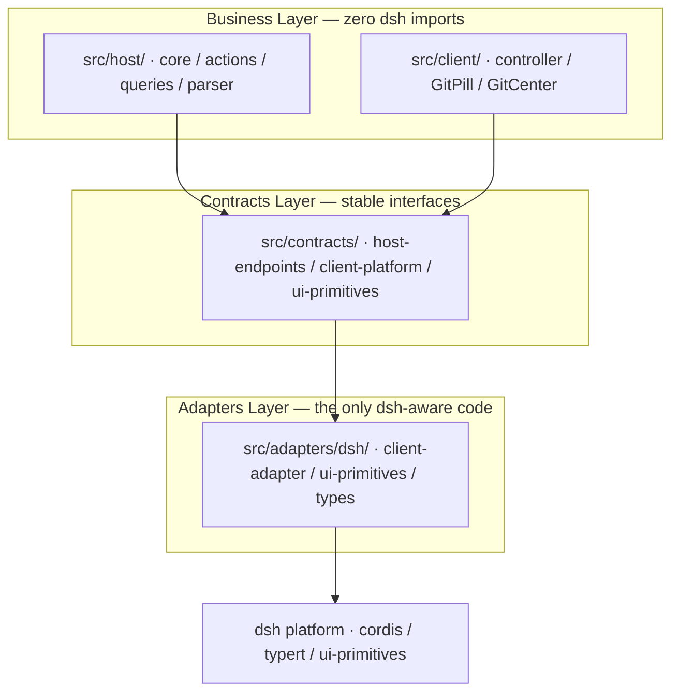

# dsh-git-ui

[](https://www.npmjs.com/package/dsh-git-ui)
[](https://www.npmjs.com/package/dsh-git-ui)
[](https://www.npmjs.com/package/dsh-git-ui)

A Git status visualizer for [DeepSeek Harness](https://github.com/deepseek-ai/deepseek-harness) (dsh) Web UI — a session-header pill, a detail popover, and a full Git center. No terminal needed.

> Read this in [简体中文](README.zh.md)

- 📦 **npm**: <https://www.npmjs.com/package/dsh-git-ui>
- 🐙 **GitHub**: <https://github.com/Julyves/dsh-git-ui>
- 🐛 **Issues**: <https://github.com/Julyves/dsh-git-ui/issues>

## At a glance

- **Pill** — branch · dirty counts (`+N −N ?N`) · ahead/behind at a glance
- **Popover** — recent commits, changed files, branch operations, one click from the pill
- **Git center** — four tabs: **History** (the landing tab), **Changes**, **Records**, **Settings**

## Session-header pill & detail popover

A status capsule in each session header. Click it for the detail popover — repository root, status counts, recent commits, changed files with inline stage / unstage / discard, and branch operations:


| State | Pill |
|---|---|
| Clean | `● main` |
| Dirty | `● main · +2 −1 ?3` |
| Ahead / behind | `● main · ↑1 ↓2` |
| Detached HEAD | `● (detached HEAD) · a1b2c3d` |
| Not a git repo | Dimmed `无 Git 仓库` |

- **Recent commits** — click one to jump into the History tab, auto-located and selected
- **Changed files** — click a file to open its diff in the Changes tab; stage / unstage / discard inline
- **Branch switcher & create** — switch or create-and-switch without leaving the popover
- **Gear icon** — straight to Settings; the popover's section **order is customizable** there

## Git center

Opened from the popover — the center keeps all four tabs mounted, so selections, filters and scroll positions survive tab switches. **History is the default landing tab.**

### History

A paginated commit list with a rendered branch graph — windowed rendering keeps thousands of rows smooth, and the selected row lights up with a glowing track (cyber-style, reduced-motion aware):


- **Filter tree** — branches / tags / author / date / text-or-hash; prefixed branch groups (`feat/*`, `fix/*`, remote origins) start **collapsed** for a tidy list; a **fetch** button syncs remote refs
- **Date filter** — `今天` means **today since local midnight** (not the last 24 h); `24 小时内` and 7/30/90-day ranges are separate options
- **Search** — text or hash prefix with a one-click **clear** button

Selecting a commit shows its subject · body · changed-file tree (foldable, status-colored). Clicking a file in the tree jumps to the **Changes tab and shows that file's diff as of that commit**, marked by a commit-hash badge:


### Changes

IDE-style groups (staged / unstaged / untracked), per-file & bulk stage / unstage / discard (two-step confirm), and a commit box:


The diff viewer:

- **View modes** — `对照` (side-by-side, default) / `变更前` / `变更后`; the split divider is **draggable** (20%–80%)
- **Markdown rendering** — `.md` files get a `渲染` mode: formatted headings, lists, tables and fenced-code highlighting; `mermaid` diagrams render natively (with a source/rendered toggle and a clear parse-error fallback)
- **New / deleted files** — pure-add and pure-delete diffs render the full file content in a single column, with a `新增` / `已删除` badge
- **Syntax highlighting & context folding** — tokenized once per file, foldable long unchanged runs

### Records

Turn work records answer "**what did this round touch, and who touched it**":


- **Pill badge** — unread `new N` plus three-way counts: `本` this session's agent · `会` other sessions' AI · `外` human edits
- **Working-period timeline** — consecutive turns merge into period cards with the **task narrative**, time window and three-way file groups (still dirty / committed / reverted / gone); periods with no output stay expandable with a `无变更产出` mark
- **Actions** — bulk-stage "AI changes" or everything; committed entries **deep-link to the exact commit** in History, auto-located
- **Confidence & correction** — authoritative entries get solid badges, heuristic ones dashed `≈`; hover and press `⇄` to reclassify authorship (persisted per repository)
- **New-output marking** — each turn's boundary fingerprint marks this round's entries `新`

### Settings

Display presets (minimal / standard / full, purely derived — tweaks snap back when they match a preset again), per-component switches for pill and popover, popover **section ordering**, and diff-viewer options:


- **Pill vs popover** — independent switches, including the work-record **badge** (pill) and the work-record **section** (popover), controlled separately
- **Popover sections** — reorder with up/down arrows; hidden sections stay in the sequence and appear at their position when enabled
- **Diff viewer** — code font size, syntax highlight, context folding; `最近提交` count (0 = hidden)

## Installation

Requires a running [DeepSeek Harness](https://github.com/deepseek-ai/deepseek-harness) with the `web` profile:

```sh
dsh plugin --profile web add dsh-git-ui
```

Restart dsh web. Open a session in a git repository and the pill appears in the header. Remove with `dsh plugin --profile web remove dsh-git-ui`.

> Local development install: `dsh plugin --profile web add ./` links this repo.
> Keep the dev peer symlinks in `node_modules/@deepseek-ai/*` (see [Development](#development)).

## Usage

1. Open a session whose working directory is inside a git repository.
2. Read the pill any time — no action needed.
3. Click the pill to inspect counts, recent commits and changed files; open the Git center for full management.

Each session shows the status of **its own working directory**; non-repository sessions show a dimmed placeholder.

## Configuration (optional)

All defaults work out of the box. Advanced users may override the plugin config in the profile's `cordis.patch.yml`:

```yaml
- id: git-ui
  config:
    defaultRefreshIntervalMs: 60000   # fallback polling interval (ms); 0 disables polling
    maxChanges: 200                   # max changed-file entries in a snapshot
    timeoutMs: 3000                   # per git-command timeout (ms)
    maxStatusBytes: 8388608           # status-output cap before truncation
    dshHome: /path/to/harness-home    # optional: Harness home (default $DSH_HOME → ~/.dsh)
    watchEnabled: true                # event-driven refresh via file watching
    watchDebounceMs: 300              # change-quiet window before notifying
    watchMaxWaitMs: 2000              # debounce starvation cap (build storms)
    watchExcludes: [node_modules, .git]  # worktree-watch noise exclusions
```

## Requirements

- Node.js `^22.19.0 || >=24.0.0`
- dsh `>= 0.1.0-rc` (developer preview)
- `git` ≥ 2.15 on the host machine (for `--no-optional-locks`)

## Known limitations

- Shows the session's working directory only; push / pull / merge are not exposed.
- Refresh is **event-driven**: the host watches the repository (worktree + `.git`) and the client holds one long-poll per session, so file changes surface in ~a second with zero git spawns at idle. Polling remains as a bounded fallback — a slow safety pass (4× the interval) self-heals missed events (network filesystems, watcher degradation); if watching fails outright, the client degrades to plain interval polling.
- Read-only git commands run with `--no-optional-locks`: `git status`/`git diff` no longer opportunistically refresh the index stat cache (which would re-trigger the watcher). The theoretical racy-git same-mtime window is negligible on modern nanosecond-granularity filesystems.
- The changed-file list is capped (`maxChanges`), with spill-file recovery for oversized status output.
- The browser only ever sends a `sessionId` — the host resolves cwd and runs git with path guards.
- Turn records are heuristic for dynamically-constructed bash targets (`$(...)`, globs, `eval`) — they fall back to `外` with a visible `≈` mark; cold sessions are skipped; observation timelines are capped.
- Syntax highlighting ships a bundle-budget language subset; mermaid support covers flowchart / graph and sequenceDiagram subsets.

## Development

```sh
pnpm install
# Link the host-provided peers so a local profile install resolves them:
mkdir -p node_modules/@deepseek-ai
for p in "$HOME"/.dsh/profiles/node_modules/@deepseek-ai/*; do
  ln -sfn "$p" "node_modules/@deepseek-ai/$(basename "$p")"
done
pnpm run typecheck && pnpm test && pnpm run build
dsh plugin --profile web add ./   # local install; restart dsh web to verify
```

### Architecture

The plugin is layered to isolate the dsh platform behind a narrow adapter seam:



- `src/contracts/` — the plugin's own stable interfaces, no dsh imports
- `src/host/` / `src/client/` — business logic against those interfaces
- `src/adapters/dsh/` — the **only** place importing `@deepseek-ai/*`; a dsh upgrade only changes here

## License

[MIT](LICENSE)