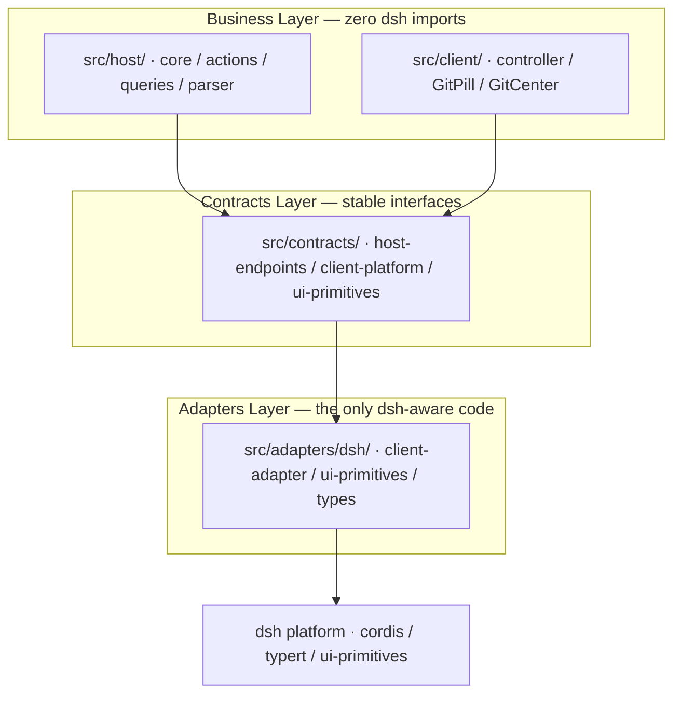

# dsh-git-ui

[](https://www.npmjs.com/package/dsh-git-ui)
[](https://www.npmjs.com/package/dsh-git-ui)
[](https://www.npmjs.com/package/dsh-git-ui)

A [DeepSeek Harness](https://github.com/deepseek-ai/deepseek-harness) (dsh) plugin that visualizes Git status in the Web UI — the session-header pill shows the current branch (or detached HEAD) and dirty-state counts (staged / modified / untracked) with ahead/behind at a glance. Click for recent commits and changed files, or open the Git center for full management. No terminal needed.

> Read this in [简体中文](README.zh.md).

- 📦 **npm**: <https://www.npmjs.com/package/dsh-git-ui>
- 🐙 **GitHub**: <https://github.com/Julyves/dsh-git-ui>
- 🐛 **Issues**: <https://github.com/Julyves/dsh-git-ui/issues>

## Features

- **Branch pill** in the session header (right-aligned, per-session): a status dot (green when clean, orange when dirty) followed by the branch name and dirty / ahead-behind badges — click to open the detail popover:

  

  | State | Pill |
  |---|---|
  | Clean | `● main` |
  | Dirty | `● main · +2 −1 ?3` |
  | Ahead / behind | `● main · ↑1 ↓2` |
  | Detached HEAD | `● (detached HEAD) · a1b2c3d` |
  | Unborn (no commits) | `● main · 无提交` |
  | Not a git repo | Dimmed `无 Git 仓库` |
  | Git unavailable / error | Dimmed `Git 不可用` (reason in tooltip) |

  `+N −N ?N` = staged / modified / untracked; `↑N ↓N` = ahead / behind. When both dirty and ahead/behind, the badges combine (e.g. `● main · +2 −1 ?3 · ↑1 ↓2`).

- **Detail popover** (click the pill): repository root, status counts (staged / modified / untracked) with dirty and ahead/behind badges, recent commits (hash · subject · author · relative time), a changed-file list with status chips and inline per-file actions (stage / unstage / discard), an inline branch switcher, a manual refresh button, and last-checked time:

  

- **Git center** (management panel opened from the popover): two tabs — **Changes** and **History**.
  - *Changes*: IDE-style grouped lists (staged / unstaged / untracked), per-file and bulk stage / unstage / discard (two-step confirm), a commit box (selected files or everything staged), and an inline side-by-side diff for the selected file with prev/next navigation.
  - *History*: a paginated commit list with a rendered branch graph, per-commit details (subject · body · changed-file tree), and filters by branch / tag / author / date / text-or-hash, plus a fetch-remote button.

  Every operation refreshes the status instantly:

  

  

  

- **Always-fresh data, zero interaction**: automatic status snapshot on session open, silent polling (host-configured interval, default 30s, no overlapping requests), **immediate refresh when an agent turn completes** (best-effort — the working tree most likely changed right then), resync after reconnect, and a manual refresh button.
- **Deterministic degradation**: non-git directories, missing cwd, missing git, timeouts, and oversized repositories show stable fallback states — never crashes, never spams.
- **Zero agent impact**: adds no model tools and writes no session events — it never changes agent behavior. Git operations in the center (stage / commit / branch / fetch) are user-initiated from the UI, never agent-driven.

## Installation

Requires a running [DeepSeek Harness](https://github.com/deepseek-ai/deepseek-harness) (dsh) with the `web` profile.

```sh
# Install from the npm registry.
dsh plugin --profile web add dsh-git-ui
```

Restart dsh web. Open a session in a git repository and the branch pill appears in the session header.

To verify the install:

```sh
cat ~/.dsh/profiles/web/package.json   # dsh.profile.bundles should list dsh-git-ui
```

To remove:

```sh
dsh plugin --profile web remove dsh-git-ui
```

> Local development install (links this repo into the profile instead):
> `dsh plugin --profile web add ./`. Local tarball / link installs
> (`file:...tgz`, `github:...`) symlink the package outside the profile tree,
> so its `@deepseek-ai/*` peer dependencies (provided by the host
> installation) are not reachable by Node's resolution. Keep the dev peer
> symlinks in this repo's `node_modules/@deepseek-ai/*`
> (see [Development](#development)) whenever installing locally.

## Usage

1. Open a session whose working directory is inside a git repository.
2. Read the branch pill in the header at any time — no action needed.
3. Click the pill to inspect repository root, counts, recent commits, and changed files; use `刷新` (refresh) for an immediate re-check, or open the Git center for full change management and history.

Each session shows the Git status of **its own working directory**. Non-repository sessions show a dimmed placeholder instead of the pill.

## Configuration (optional)

All defaults work out of the box. Advanced users may override the plugin config in the profile's `cordis.patch.yml` (a later layer wins; the row replaces the whole `config`):

```yaml
- id: git-ui
  config:
    defaultRefreshIntervalMs: 60000   # polling interval (ms); 0 disables polling
    maxChanges: 200                   # max changed-file entries in a snapshot
    timeoutMs: 3000                   # per git-command timeout (ms)
    maxStatusBytes: 8388608           # status-output cap before truncation
```

## Requirements

- Node.js `^22.19.0 || >=24.0.0`
- dsh `>= 0.1.0-rc` (developer preview)
- `git` on the host machine (the plugin shells out to `git`)

## Known Limitations

- Shows the Git state of the session's working directory only. The History filter tree lists remote branches with ahead/behind and a manual fetch, but push / pull / merge are not exposed.
- Polling-based refresh (default 30s); file-watcher event push is a planned extension.
- Changed-file list is capped (`maxChanges`); untracked-directory contents are enumerated individually. When status output overflows the in-memory cap (default 4 MiB) it is recovered from a private spill file so counts stay exact — only if the spill cap (64 MiB) also overflows does the snapshot fall back to approximate (`truncated: true`).
- Browser never sends paths — only a `sessionId`; the host resolves the authoritative cwd and runs git commands (write operations use `--` path separation and reject absolute / `..` escapes).

## Development

```sh
pnpm install
# Link the host-provided peers into the repo so a local profile install
# (`dsh plugin --profile web add ./`) resolves them: pnpm symlinks the
# package into the profile, and Node follows the realpath back into this
# repo, so `node_modules/@deepseek-ai/*` must point at the host fallback.
mkdir -p node_modules/@deepseek-ai
for p in "$HOME"/.dsh/profiles/node_modules/@deepseek-ai/*; do
  ln -sfn "$p" "node_modules/@deepseek-ai/$(basename "$p")"
done
pnpm run typecheck
pnpm test
pnpm run build        # host (esbuild ESM, never minified) + client (ModuleLoader factory closure)
dsh plugin --profile web add ./   # local install; restart dsh web to verify
```

### Architecture

The plugin is layered to isolate the dsh platform behind a narrow adapter seam,
so business logic stays untouched when dsh APIs evolve:



- `src/contracts/` defines the plugin's own stable interfaces (no dsh imports).
- `src/host/` and `src/client/` implement business logic against those interfaces.
- `src/adapters/dsh/` is the **only** place that imports `@deepseek-ai/*`;
  a dsh upgrade only requires changes here.

## License

[MIT](LICENSE)
