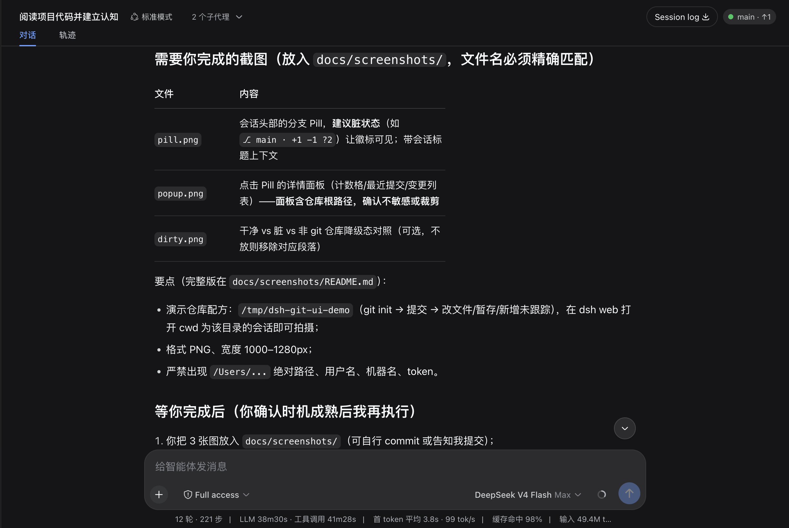
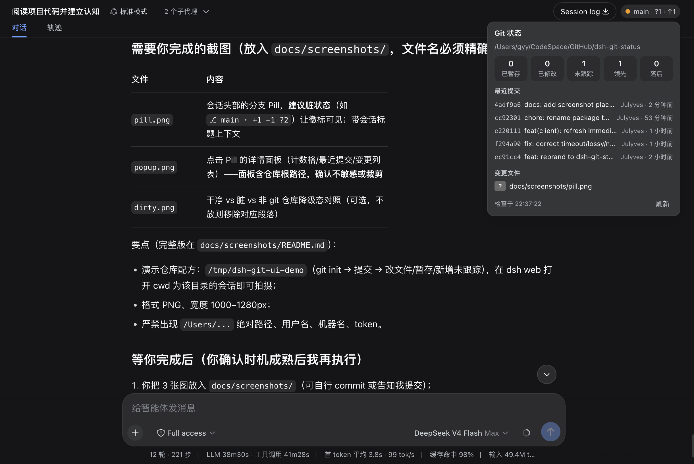
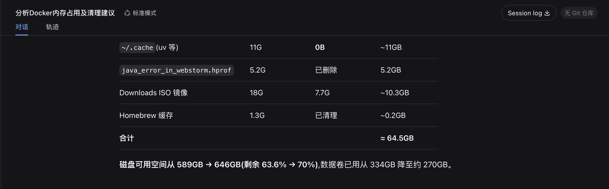

# dsh-git-ui

[](https://www.npmjs.com/package/dsh-git-ui)
[](https://www.npmjs.com/package/dsh-git-ui)
[](https://www.npmjs.com/package/dsh-git-ui)

[DeepSeek Harness](https://github.com/deepseek-ai/deepseek-harness)（dsh）Web UI 插件：在会话界面中可视化展示当前工程的 Git 状态——分支、HEAD、脏状态计数（已暂存/已修改/未跟踪）、领先/落后、最近提交与变更文件。无需切换终端，扫一眼即得。

> English version: [README.md](README.md)

- 📦 **npm**：<https://www.npmjs.com/package/dsh-git-ui>
- 🐙 **GitHub**：<https://github.com/Julyves/dsh-git-ui>
- 🐛 **Issues**：<https://github.com/Julyves/dsh-git-ui/issues>

## 功能特性

- **会话头部分支 Pill**（右侧、每会话独立）：常态只显示分支，脏状态与领先/落后以徽标呈现：

  

  | 状态 | Pill 显示 |
  |---|---|
  | 干净 | `⎇ main` |
  | 脏状态 | `⎇ main · +2 −1 ?3`（已暂存/已修改/未跟踪） |
  | 领先/落后 | `⎇ main ↑1 ↓2` |
  | 游离 HEAD | `⎇ (detached) · a1b2c3d` |
  | unborn（无提交） | `⎇ main · 无提交` |
  | 非 git 仓库 | 弱化显示 `无 Git 仓库` |
  | git 不可用/出错 | 弱化显示 `Git 不可用`（tooltip 显示原因） |

- **详情面板**（点击 pill 展开）：仓库根目录、计数格（已暂存/已修改/未跟踪/领先/落后）、最近提交（哈希·主题·作者·相对时间）、变更文件列表（状态 chip）、手动刷新按钮、上次检查时间：

  

- **Git 中心**（从面板进入的管理面板）：IDE 式变更视图——单文件/全部暂存、取消暂存、丢弃，以及带提交信息的提交（勾选文件或全部已暂存）。每次操作即时刷新状态。
- **数据自动保鲜，零操作**：进入会话自动拉取、静默轮询（间隔由主机下发，默认 30s，不重叠请求）、**agent 完成一个回合后立即刷新**（尽力而为——此时工作区最可能已变化）、断线重连 resync、面板内手动刷新。
- **确定性降级**：非 git 目录、无 cwd、git 缺失、超时、巨型仓库等边界显示稳定降级态——不崩溃、不刷屏：

  

- **纯只读 UI**：不给模型新增工具、不写会话事件，不改变 agent 的任何行为。

## 安装

需要已安装 [DeepSeek Harness](https://github.com/deepseek-ai/deepseek-harness)（dsh）且使用 `web` profile。

```sh
# 从 npm registry 安装。
dsh plugin --profile web add dsh-git-ui
```

安装后**重启 dsh web**。在 git 仓库目录打开会话，头部即出现分支 Pill。

验证安装：

```sh
cat ~/.dsh/profiles/web/package.json   # dsh.profile.bundles 中应包含 dsh-git-ui
```

卸载：

```sh
dsh plugin --profile web remove dsh-git-ui
```

> 本地开发安装（把本仓库链接进 profile）：`dsh plugin --profile web add ./`。
> 本地 tgz / 目录 / GitHub 直装（`file:...tgz`、`github:...`）会把包以 symlink
> 方式装进 profile，Node 沿真实路径解析时无法触达宿主提供的 `@deepseek-ai/*`
> peer 依赖。本地安装时请保持本仓库 `node_modules/@deepseek-ai/*` 的 peer 链接
> 存在（步骤见 [开发](#开发)）。

## 使用方式

1. 打开一个工作目录位于 git 仓库内的会话。
2. 随时扫一眼头部 Pill——无需任何操作。
3. 点击 Pill 查看仓库根目录、计数、最近提交与变更文件；点 `刷新` 立即重新检查。

每个会话显示**自己工作目录**的 Git 状态；非仓库会话显示弱化占位而非 Pill。

## 配置（可选）

默认零配置开箱即用。高级用户可在 profile 的 `cordis.patch.yml` 中覆盖插件配置（后层覆盖，整行替换 `config`）：

```yaml
- id: git-ui
  config:
    defaultRefreshIntervalMs: 60000   # 轮询间隔（毫秒）；0 = 关闭轮询
    maxChanges: 200                   # 快照中变更文件条数上限
    timeoutMs: 3000                   # 单条 git 命令超时（毫秒）
    maxStatusBytes: 8388608           # status 输出上限，超出截断
```

## 环境要求

- Node.js `^22.19.0 || >=24.0.0`
- dsh `>= 0.1.0-rc`（开发者预览版）
- 主机可执行 `git`（插件通过子进程调用只读 git 命令）

## 已知限制

- 仅展示会话工作目录的 Git 状态（远程 URL、push 分支名暂未支持）。
- 轮询式刷新（默认 30s）；基于文件监听的事件推送为规划中的扩展。
- 变更文件列表有上限（`maxChanges`）；status 输出超过内存上限（默认 4 MiB）时会从私有 spill 文件恢复完整输出，**计数保持精确**——仅当 spill 上限（64 MiB）也被突破时才回退为近似（`truncated: true`）。
- 浏览器只传 `sessionId`，不传路径；主机解析权威 cwd 并仅执行只读 git 命令。

## 开发

```sh
pnpm install
# 把宿主提供的 peer 依赖链接进仓库，本地 `dsh plugin --profile web add ./` 才能解析：
# pnpm 以 symlink 把包装进 profile，Node 沿真实路径回到本仓库，
# 因此 node_modules/@deepseek-ai/* 需要指向宿主的 fallback 目录。
mkdir -p node_modules/@deepseek-ai
for p in "$HOME"/.dsh/profiles/node_modules/@deepseek-ai/*; do
  ln -sfn "$p" "node_modules/@deepseek-ai/$(basename "$p")"
done
pnpm run typecheck
pnpm test
pnpm run build        # host（esbuild ESM，禁止压缩）+ client（ModuleLoader factory 闭包）
dsh plugin --profile web add ./   # 本地安装；重启 dsh web 验证
```

## 许可证

[MIT](LICENSE)
