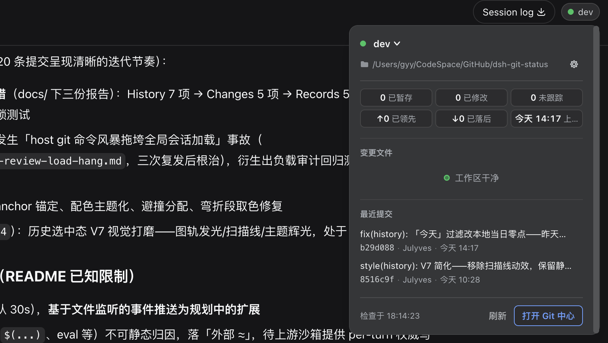
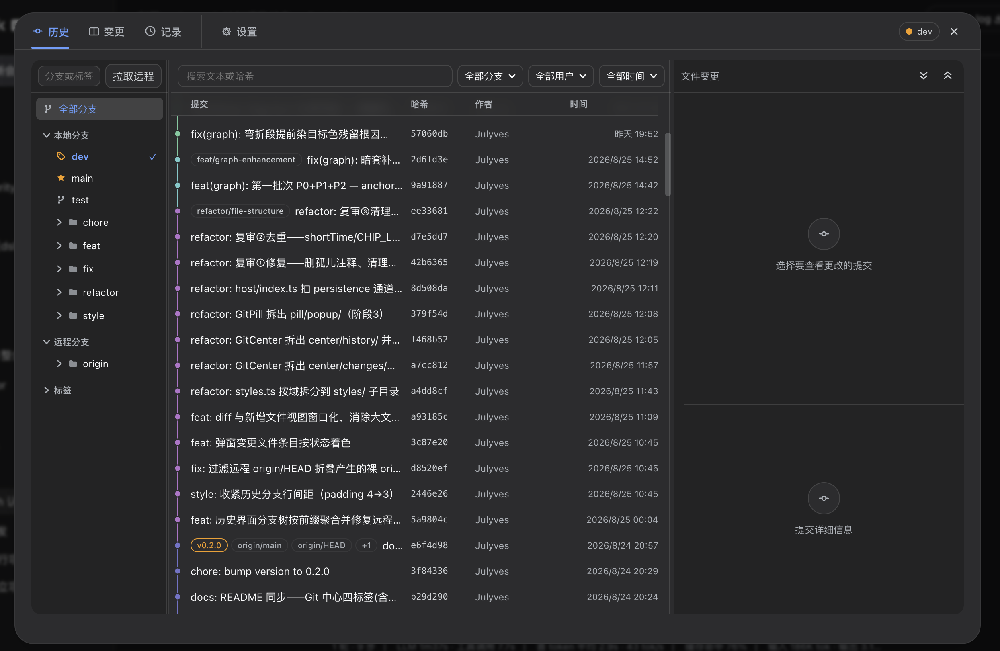
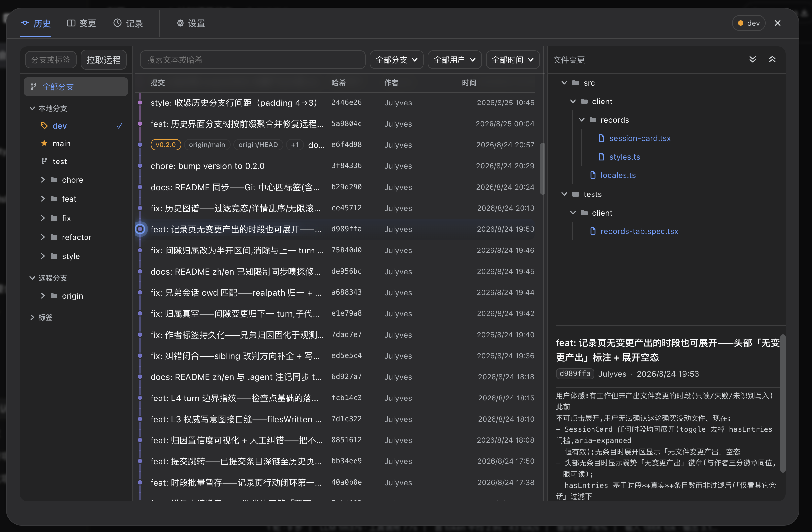
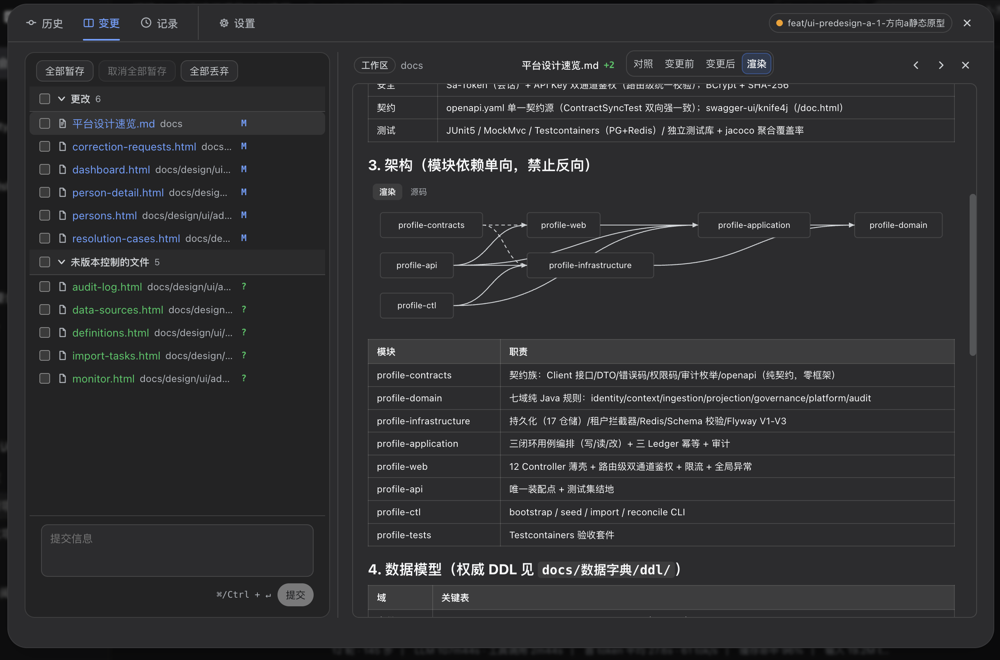
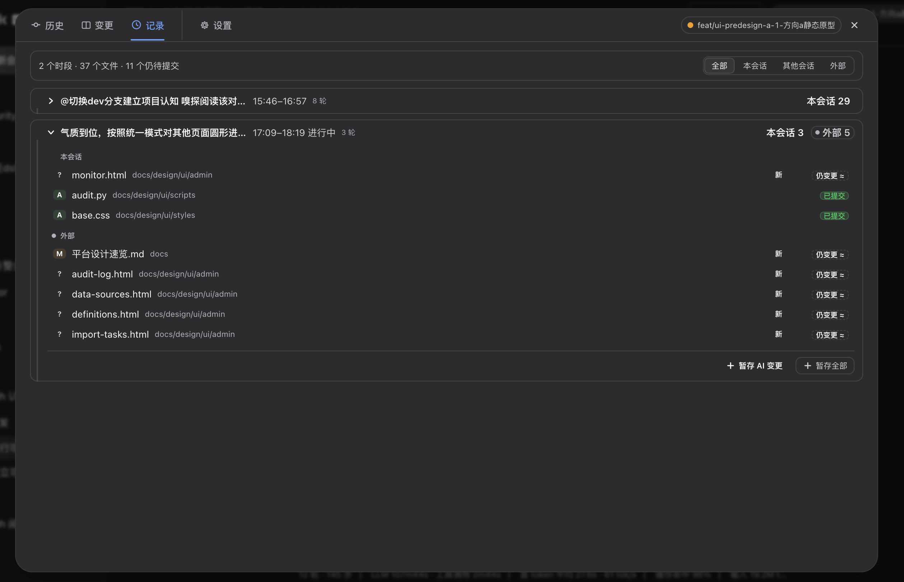
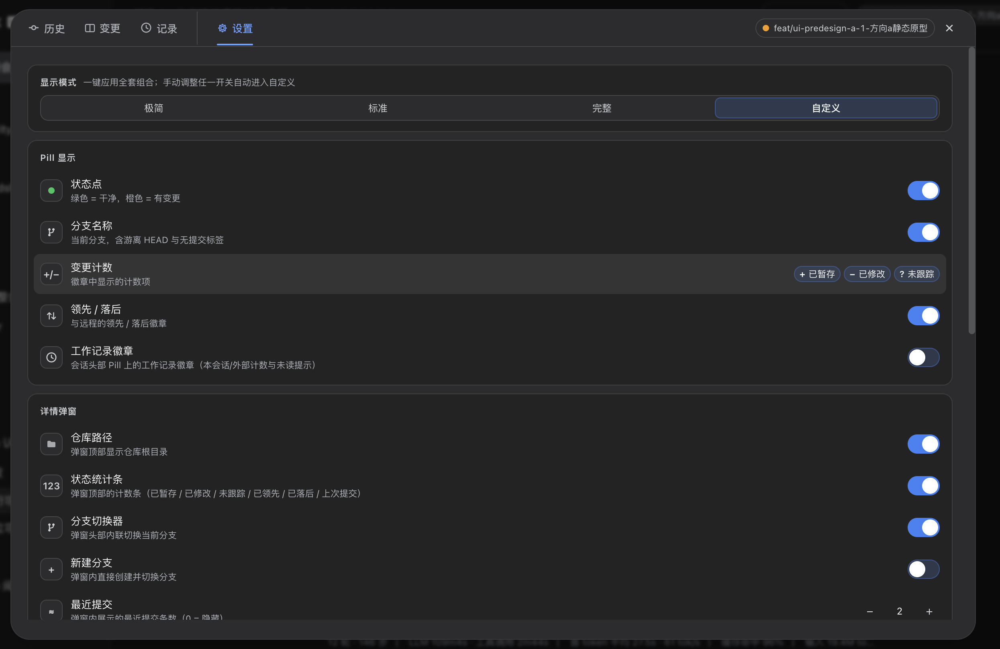
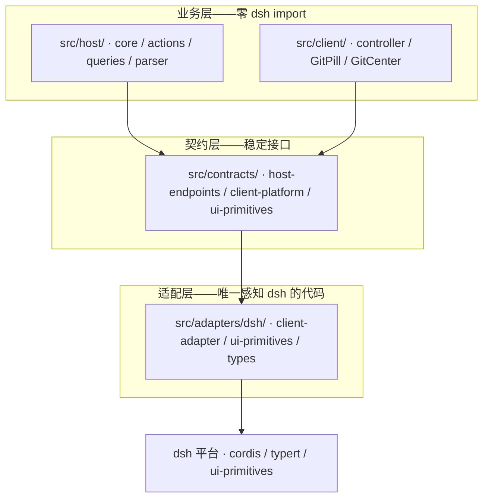

# dsh-git-ui

[](https://www.npmjs.com/package/dsh-git-ui)
[](https://www.npmjs.com/package/dsh-git-ui)
[](https://www.npmjs.com/package/dsh-git-ui)

[DeepSeek Harness](https://github.com/deepseek-ai/deepseek-harness)（dsh）Web UI 的 Git 状态可视化插件——会话头部的 Pill 胶囊、详情弹窗与完整的 Git 中心，无需切换终端。

> Read this in [English](README.md)

- 📦 **npm**: <https://www.npmjs.com/package/dsh-git-ui>
- 🐙 **GitHub**: <https://github.com/Julyves/dsh-git-ui>
- 🐛 **Issues**: <https://github.com/Julyves/dsh-git-ui/issues>

## 一览

- **Pill 胶囊** — 分支 · 脏计数（`+N −N ?N`）· 领先/落后
- **详情弹窗** — 最近提交、变更文件、分支操作，点击胶囊即达
- **Git 中心** — 四个标签：**历史**（默认落地页）、**变更**、**记录**、**设置**

## 会话头部 Pill 与详情弹窗

每个会话头部一个状态胶囊；点击展开详情弹窗——仓库根、状态计数、最近提交、带行内暂存/取消/丢弃的变更文件，以及分支操作：



| 状态 | Pill |
|---|---|
| 干净 | `● main` |
| 有变更 | `● main · +2 −1 ?3` |
| 领先 / 落后 | `● main · ↑1 ↓2` |
| 游离 HEAD | `● (detached HEAD) · a1b2c3d` |
| 非 Git 仓库 | 弱化 `无 Git 仓库` |

- **最近提交** — 点击即跳转历史标签，自动定位并选中该提交
- **变更文件** — 点击在变更页打开该文件对照；行内暂存/取消/丢弃
- **分支切换与新建** — 弹窗内直接切换或创建并切换
- **齿轮入口** — 直达设置；弹窗内区块的**排列顺序**可在设置中自定义

## Git 中心

从弹窗打开——四个标签保持挂载，选中、过滤与滚动位置在切换间不丢失。**历史为默认首项。**

### 历史

分页提交列表 + SVG 分支图渲染——窗口化渲染保证数千行流畅；选中行以发光轨道点亮（赛博风格，自动适配减弱动效）：



- **过滤树** — 分支/标签/作者/日期/文本或哈希；前缀分组（`feat/*`、`fix/*`、远程 origin 组）**默认收起**更规整；**拉取**按钮同步远程引用
- **日期过滤** — `今天` = **本地当日零点起**（非 24 小时）；`24 小时内` 与近 7/30/90 天为独立档位
- **搜索** — 文本或哈希前缀，一键**清除**

选中提交后展示主题·正文·变更文件树（目录可折叠、按状态着色）。点击文件树中的文件**跳转变更页，以该提交为基线展示此文件的变更**，并以提交哈希徽标标识所属提交：



### 变更

IDE 式三段分组（已暂存/更改/未跟踪）、单文件与批量暂存/取消/丢弃（两步确认）、提交框：



差异查看器：

- **视图三态** — `对照`（前后并排，默认）/ `变更前` / `变更后`；并排分隔条可**拖拽调占比**（20%–80%）
- **Markdown 渲染** — `.md` 文件提供 `渲染` 档：标题/列表/表格/围栏代码高亮；`mermaid` 图原生渲染（含渲染/源码切换与解析失败提示）
- **新增/删除文件** — 纯新增与纯删除差异单栏全宽展示完整文件内容，带 `新增`/`已删除` 徽标
- **语法高亮与上下文折叠** — 整块 tokenize 一次、长冗余上下文可折叠

### 记录

Turn 工作记录回答「**这一轮动了什么、谁动的**」：



- **Pill 徽章** — 未读 `new N` + 三方计数：`本` 本会话 agent · `会` 其他会话 AI · `外` 人工（IDE/终端）
- **工作时段时间线** — 连续 turn 合并为时段卡片：**任务叙事**、时间窗、三方文件分组（仍变更/已提交/已还原/已消失）；无产出时段同样可展开（`无变更产出` 标注）
- **行动闭环** — 一键批量暂存「AI 变更」或全部；已提交条目**深链历史页精确定位**
- **置信度与纠错** — 权威条目实心徽标、启发式虚线 `≈`；悬停按 `⇄` 可改判归属（仓库级持久化）
- **新输出标记** — 每轮边界指纹将本轮新条目标为 `新`

### 设置

显示预设（极简/标准/完整，纯派生——手动调整重新匹配预设时自动吸附回位）、Pill 与弹窗逐项开关、弹窗**区块排序**与差异查看器选项：



- **Pill 与弹窗独立** — 逐项开关，包括工作记录**徽章**（Pill）与工作记录**区块**（弹窗）分开控制
- **弹窗区块排序** — 上下箭头重排；隐藏区块保留在序列中，开启后按序出现
- **差异查看器** — 代码字号、语法高亮、上下文折叠；`最近提交` 条数（0 = 隐藏）

## 安装

需要已运行 [DeepSeek Harness](https://github.com/deepseek-ai/deepseek-harness) 且使用 `web` profile：

```sh
dsh plugin --profile web add dsh-git-ui
```

重启 dsh web。在 git 仓库的会话中打开即可见头部 Pill。卸载：`dsh plugin --profile web remove dsh-git-ui`。

> 本地开发安装：`dsh plugin --profile web add ./` 会以 link 方式接入本仓库；
> 需保持 `node_modules/@deepseek-ai/*` 的开发 peer 符号链接（见[开发](#开发)）。

## 使用方式

1. 打开一个工作目录在 git 仓库内的会话。
2. 随时阅读 Pill 即可——无需任何操作。
3. 点击 Pill 查看计数、最近提交与变更文件；或打开 Git 中心进行完整管理。

每个会话展示**其自身工作目录**的状态；非仓库会话显示弱化占位符。

## 配置（可选）

默认开箱即用。高级用户可在 profile 的 `cordis.patch.yml` 中覆盖插件配置：

```yaml
- id: git-ui
  config:
    defaultRefreshIntervalMs: 60000   # 兜底轮询间隔（毫秒）；0 关闭轮询定时器
    maxChanges: 200                   # 快照中变更文件条目上限
    timeoutMs: 3000                   # 每条 git 命令超时（毫秒）
    maxStatusBytes: 8388608           # status 输出截断上限
    dshHome: /path/to/harness-home    # 可选：Harness 家目录（默认 $DSH_HOME → ~/.dsh）
    watchEnabled: true                # 事件驱动刷新（文件监听）
    watchDebounceMs: 300              # 变更静默窗（防抖合并）
    watchMaxWaitMs: 2000              # 防抖饥饿上限（事件风暴期间每 2 秒至多一刷）
    watchExcludes: [node_modules, .git]  # 工作区监听的事件级排除目录
```

## 环境要求

- Node.js `^22.19.0 || >=24.0.0`
- dsh `>= 0.1.0-rc`（开发者预览版）
- 宿主已安装 `git`（≥ 2.15，`--no-optional-locks` 所需）

## 已知限制

- 仅展示会话工作目录的状态；push / pull / merge 未开放。
- 刷新为**事件驱动**：宿主监听仓库（工作区 + `.git`），客户端每会话驻留一条长轮询——文件变动约一秒内感知，空闲时零 git 子进程。轮询保留为有界兜底：慢速安全轮询（间隔 ×4）自愈漏事件（网络盘、监听降级）；监听彻底失败时退化为普通间隔轮询。
- 只读 git 命令以 `--no-optional-locks` 运行：`git status`/`git diff` 不再机会性刷新索引 stat 缓存（该写入会反过来触发监听）。理论上的 racy-git 同 mtime 漏报窗口在现代纳秒粒度文件系统上可忽略。
- 变更文件列表有上限（`maxChanges`）；超大 status 输出经 spill 文件兜底恢复计数。
- 浏览器只发送 `sessionId`——宿主解析 cwd 并以路径守卫运行 git 命令。
- Turn 记录对动态构造的 bash 目标（`$(...)`、glob、`eval`）为启发式——回落 `外` 并带可见 `≈` 标记；冷会话跳过；观测时间线有上限。
- 语法高亮为预算裁剪的语言子集；mermaid 支持 flowchart/graph 与 sequenceDiagram 子集。

## 开发

```sh
pnpm install
# 链接宿主提供的 peer 依赖，使本地 profile 安装可解析：
mkdir -p node_modules/@deepseek-ai
for p in "$HOME"/.dsh/profiles/node_modules/@deepseek-ai/*; do
  ln -sfn "$p" "node_modules/@deepseek-ai/$(basename "$p")"
done
pnpm run typecheck && pnpm test && pnpm run build
dsh plugin --profile web add ./   # 本地安装；重启 dsh web 验证
```

### 架构

插件分层以隔离 dsh 平台，业务逻辑在 dsh API 演进时保持不变：



- `src/contracts/` — 插件自有的稳定接口，无 dsh import
- `src/host/` / `src/client/` — 基于这些接口的业务实现
- `src/adapters/dsh/` — **唯一**导入 `@deepseek-ai/*` 的地方；dsh 升级只改这里

## 许可证

[MIT](LICENSE)