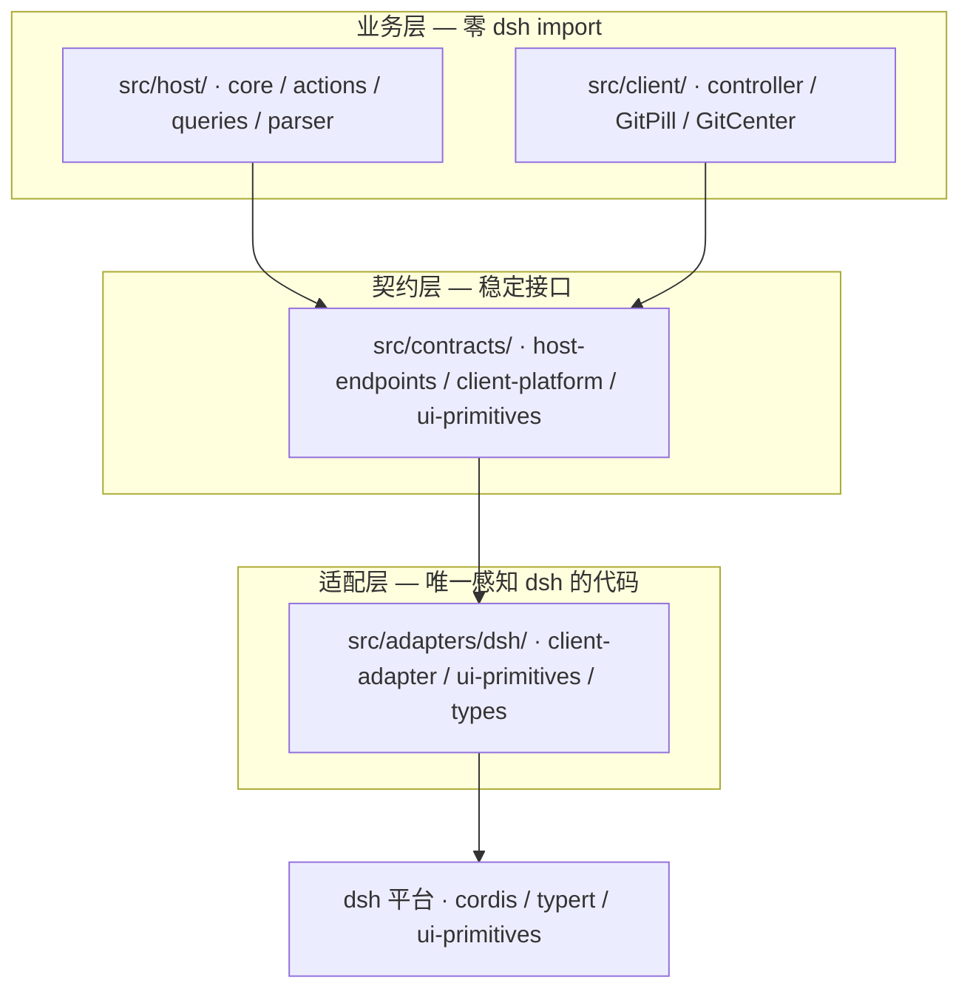

# dsh-git-ui

[](https://www.npmjs.com/package/dsh-git-ui)
[](https://www.npmjs.com/package/dsh-git-ui)
[](https://www.npmjs.com/package/dsh-git-ui)

[DeepSeek Harness](https://github.com/deepseek-ai/deepseek-harness)（dsh）Web UI 插件：在会话界面中可视化展示 Git 状态——会话头部的 Pill 一眼呈现当前分支（或游离 HEAD）与脏状态计数（已暂存/已修改/未跟踪）及领先/落后。点击查看最近提交与变更文件，或打开 Git 中心进行完整管理。无需切换终端。

> English version: [README.md](README.md)

- 📦 **npm**：<https://www.npmjs.com/package/dsh-git-ui>
- 🐙 **GitHub**：<https://github.com/Julyves/dsh-git-ui>
- 🐛 **Issues**：<https://github.com/Julyves/dsh-git-ui/issues>

## 功能特性

- **会话头部分支 Pill**（右侧、每会话独立）：状态点（干净为绿、脏为橙）+ 分支名 + 脏/领先落后徽标——点击展开详情面板：

  

  | 状态 | Pill 显示 |
  |---|---|
  | 干净 | `● main` |
  | 脏状态 | `● main · +2 −1 ?3` |
  | 领先/落后 | `● main · ↑1 ↓2` |
  | 游离 HEAD | `● (游离 HEAD) · a1b2c3d` |
  | unborn（无提交） | `● main · 无提交` |
  | 非 git 仓库 | 弱化显示 `无 Git 仓库` |
  | git 不可用/出错 | 弱化显示 `Git 不可用`（tooltip 显示原因） |

  `+N −N ?N` = 已暂存/已修改/未跟踪；`↑N ↓N` = 领先/落后。脏且领先落后时徽标合并（如 `● main · +2 −1 ?3 · ↑1 ↓2`）。

- **详情面板**（点击 pill 展开）：仓库根目录、状态计数（已暂存/已修改/未跟踪）+ 脏与领先落后徽标、最近提交（哈希·主题·作者·相对时间）、变更文件列表（状态 chip + 行内暂存/取消/丢弃操作）、分支内联切换、手动刷新按钮、上次检查时间：

  

- **Git 中心**（从面板进入的管理面板）：三个标签——**变更**、**历史**与**设置**。
  - *变更*：IDE 式三段分组（已暂存/更改/未跟踪），单文件与全部暂存/取消暂存/丢弃（两步确认）、提交框（勾选文件或全部已暂存），以及选中文件的并排差异对照（前后导航）。
  - *历史*：分页提交列表 + 分支图渲染，每条提交详情（主题·正文·变更文件树），按分支/标签/作者/日期/文本或哈希过滤，以及拉取远程按钮。
  - *设置*：**Pill 信息组件可配置化**——实时预览 + 四档显示模式（极简/标准/完整/自定义，纯派生、可一键回位）+ 逐项开关（状态点、分支名、变更计数三子项、领先/落后；弹窗的仓库路径、状态统计条、分支切换器、新建分支、最近提交条数、变更文件列表）。点击键盘齿轮图标（弹窗头部）可直达：

- **差异对照增强**（变更标签的并排查看）：
  - **新增文件直接展示**：纯新增（`--- /dev/null` 形态）不再渲染左侧空白对照列——单栏全宽直接展示创建后的完整文件内容（含行号）；0 字节空文件显示「文件为空」而非无意义的空差异。
  - **语法高亮**：按文件类型（shiki TextMate grammar，JS 引擎无 WASM）着色关键字/字符串/注释/数字等；整块 tokenize 后按行渲染，跨行注释与多行字符串保持正确。颜色复用宿主主题的 `--shiki-*` token（亮/暗自适应）；高亮开关与代码字号可在设置中调整。bundle 预算约束下的语言子集与近似映射（C++→C、HTML→XML、SCSS/LESS→CSS）见[已知限制](#已知限制)。
  - **上下文折叠**：连续 12 行以上未变更的上下文段折叠为「… N 行未变更」横条（点击展开/收起），长 diff 导航更省屏；可在设置关闭。
  - **缺陷修复**：`\ No newline at end of file` 标记不再破坏行号对齐。
  - **设置项**：差异查看组——代码字号（10–16px）、语法高亮开关、上下文折叠开关；独立于显示模式档位（调它们不把档位打回「自定义」）。

- **数据持久化于宿主磁盘（v2）**：设置不再存 localStorage——全部落盘于 dsh Harness home 下的 `plugin-data/dsh-git-ui/settings.json`（`$DSH_HOME` → `~/.dsh`，可在 profile 配置中覆盖 `dshHome`），原子写入（临时文件 + rename）、跨设备重启存活。浏览器仅经 host RPC 读写（严格文件名白名单）；初始化时自动将 v1 的 localStorage 旧设置一次性迁移并写回磁盘（后续不再读取该键）。
- **Turn 工作记录**：按 turn 归因文件系统变更，统计严格基于 git（ignored / 仓库外文件不计）。两种模式：
  - **单 turn 模式（pill，默认）**：胶囊展示最近工作时段的紧凑徽章——增量未读优先（自上次查看 `新 N`，查看即清零），其后为作者三分计数（`本` 本会话 agent / `会` 其他 dsh 会话 AI / `外` 人工）；点击胶囊查看分组文件列表与任务叙事；【设置】中可关闭徽章。
  - **全 session 模式（Git 中心「记录」标签）**：连续有工作的 turn 聚合为**工作时段**（默认间隔 10 分钟内合并）——单栏时段卡片流：时段头部为**任务叙事**（驱动该时段的用户指令摘要，「做了什么」先于「何时」）+ 时间窗 + 三分计数，展开为「本会话 / 其他会话 / 外部」三组文件（状态徽章：仍变更 / 已提交 / 已还原 / 已离开）；顶部工具栏提供摘要（时段数 · 文件数 · 仍待提交）与四路过滤（全部 / 本会话 / 其他会话 / 外部）。
  - **作者三分**：`本会话`（本会话 agent 含 subagent 委托）/ `其他会话`（同工作区其他 dsh 会话的 AI 写入）/ `外部`（人工：IDE / 命令行 / 未识别来源）——归因轴对齐用户心智：「AI 改的」与「我改的」不再混桶。
  - **行动闭环**：时段卡片展开区支持**批量暂存**（「暂存 AI 变更」= 本会话+其他会话的仍变更、不带人工 WIP；「暂存全部」）；**已提交条目点击直达历史页对应提交**（提交哈希深链，自动定位并选中）。
  - **归因置信度 + 人工纠错**：平台自证写意图（diff 卡 / 写类卡 / result meta）的条目为实心徽章；启发式推断（bash 静态目标 / args 兜底 / 时间窗归因）的条目为虚线徽章 + `≈` 标记——误差可见。悬停条目 `⇄` 可人工改判归因（仓库级持久化于 `plugin-data/dsh-git-ui/overrides.json`，弹窗/记录页/未读计数统一生效）。
  - **检查点基础（turn 边界指纹）**：每次快照幂等捕获最新 turn 的边界变更路径集（`fp-<会话>.jsonl` 持久化）；条目不在**上一轮边界指纹**中标记「新」（本轮新增）。内容级快照与轮级回滚为检查点终局方向，暂未提供。
  - **实现要点**：宿主折叠会话事件日志（`turn/start`·`turn/end`·`tool/call`·`user/message` 自带时间戳）得到精确的 per-turn 窗口与任务叙事（compaction 折叠后由 `narr-<会话>.jsonl` 恢复）；复用每个工具自声明的 `presentCall` 写意图提取 agent 写路径（bash 走静态目标启发式：重定向 / tee / sed -i / cp-mv / dd of=）；其他会话写入经同 cwd 会话枚举归并（零 git 命令）；外部变更经轮询观测时间线归因（每路径首见时刻 + HEAD 移动提交检测（`--format=%H` 同条命令携带提交哈希，供深链）+ 仍脏文件的 mtime 精修）。观测时间线持久化于 `plugin-data/dsh-git-ui/obs-<会话>.jsonl`（原子写；恢复时对账提交判定），宿主重启后记录不丢。**L3 接口缝**：`TurnRecordSources.filesWritten`（上游沙箱 per-turn 权威写集）就绪时整体旁路启发式归因。

  每次操作即时刷新状态：

  

  

  

- **数据自动保鲜，零操作**：进入会话自动加载状态快照、静默轮询（间隔由主机下发，默认 30s，不重叠请求）、**agent 完成一个回合后立即刷新**（尽力而为——此时工作区最可能已变化）、断线重连 resync、面板内手动刷新。
- **确定性降级**：非 git 目录、无 cwd、git 缺失、超时、巨型仓库等边界显示稳定降级态——不崩溃、不刷屏。
- **零 agent 影响**：不给模型新增工具、不写会话事件，从不改变 agent 行为。Git 中心的写操作（暂存/提交/分支/拉取）均由用户从 UI 主动发起，绝非 agent 驱动。

## 安装

需要已安装 [DeepSeek Harness](https://github.com/deepseek-ai/deepseek-harness)（dsh）且使用 `web` profile。

```sh
# 从 npm registry 安装。
dsh plugin --profile web add dsh-git-ui
```

安装后**重启 dsh web**。在 git 仓库目录打开会话，头部即出现分支 Pill。

验证安装：

```sh
cat ~/.dsh/profiles/web/package.json   # dsh.profile.bundles 中应包含 dsh-git-ui
```

卸载：

```sh
dsh plugin --profile web remove dsh-git-ui
```

> 本地开发安装（把本仓库链接进 profile）：`dsh plugin --profile web add ./`。
> 本地 tgz / 目录 / GitHub 直装（`file:...tgz`、`github:...`）会把包以 symlink
> 方式装进 profile，Node 沿真实路径解析时无法触达宿主提供的 `@deepseek-ai/*`
> peer 依赖。本地安装时请保持本仓库 `node_modules/@deepseek-ai/*` 的 peer 链接
> 存在（步骤见 [开发](#开发)）。

## 使用方式

1. 打开一个工作目录位于 git 仓库内的会话。
2. 随时扫一眼头部 Pill——无需任何操作。
3. 点击 Pill 查看仓库根目录、计数、最近提交与变更文件；点 `刷新` 立即重新检查，或打开 Git 中心进行完整变更管理与历史浏览。

每个会话显示**自己工作目录**的 Git 状态；非仓库会话显示弱化占位而非 Pill。

## 配置（可选）

默认零配置开箱即用。高级用户可在 profile 的 `cordis.patch.yml` 中覆盖插件配置（后层覆盖，整行替换 `config`）：

```yaml
- id: git-ui
  config:
    defaultRefreshIntervalMs: 60000   # 轮询间隔（毫秒）；0 = 关闭轮询
    maxChanges: 200                   # 快照中变更文件条数上限
    timeoutMs: 3000                   # 单条 git 命令超时（毫秒）
    maxStatusBytes: 8388608           # status 输出上限，超出截断
    dshHome: /path/to/harness-home    # 可选：Harness home（默认 $DSH_HOME → ~/.dsh）
                                      # 插件数据存放于 <home>/plugin-data/dsh-git-ui/
```

## 环境要求

- Node.js `^22.19.0 || >=24.0.0`
- dsh `>= 0.1.0-rc`（开发者预览版）
- 主机可执行 `git`（插件通过子进程调用 git 命令）

## 已知限制

- 仅展示会话工作目录的 Git 状态。历史页的过滤树列出远程分支、领先/落后与手动拉取，但不暴露 push / pull / merge。
- 轮询式刷新（默认 30s）；基于文件监听的事件推送为规划中的扩展。
- 变更文件列表有上限（`maxChanges`）；未跟踪目录内部文件逐个枚举。status 输出超过内存上限（默认 4 MiB）时会从私有 spill 文件恢复完整输出，**计数保持精确**——仅当 spill 上限（64 MiB）也被突破时才回退为近似（`truncated: true`）。
- 浏览器只传 `sessionId`，不传路径；主机解析权威 cwd 并执行 git 命令（写操作用 `--` 路径分隔、拒绝绝对路径与 `..` 逃逸）。
- **Turn 工作记录**：bash 动态构造写目标（`$(...)`、glob、`find -exec`、`eval`）不可静态提取，落入「外部」且带 `≈` 推断标记（根治路径 = L3 `filesWritten` 接口缝，待上游沙箱）；冷 subagent / 冷兄弟会话（未加载）跳过对应归因；兄弟会话识别按 cwd 精确匹配（符号链接差异保守漏配，文档化）；观测时间线每会话上限 2000 条（裁剪最旧），且在一个轮询间隔内出现又消失的外部变更在宿主重启后无法重建；turn 边界指纹为首次观测点近似（轮询粒度内的先写后还原不可分）；人工改判为仓库级（跨会话生效），不随会话回收。
- 语法高亮为 bundle 预算裁剪的语言子集（TypeScript/JS 族、JSON/YAML/TOML/INI、Markdown、XML/HTML、CSS/SCSS/LESS、Python、Shell、Java、Go、Rust、C、C#、Kotlin、SQL、Makefile）。C++ 以 C grammar 近似、HTML 以 XML grammar 近似、SCSS/LESS 以 CSS grammar 近似（基础 token 正确，语言特有结构回落纯文本）；PHP、Swift、Ruby、Lua 等未注册语言**整体回落纯文本**（仍为等宽字体、不报错）。
- 设置存储（v2）迁移到宿主磁盘后不再写入 localStorage；若 host RPC 不可达（降级），设置仅停留在内存态（本次会话有效）。

## 开发

```sh
pnpm install
# 把宿主提供的 peer 依赖链接进仓库，本地 `dsh plugin --profile web add ./` 才能解析：
# pnpm 以 symlink 把包装进 profile，Node 沿真实路径回到本仓库，
# 因此 node_modules/@deepseek-ai/* 需要指向宿主的 fallback 目录。
mkdir -p node_modules/@deepseek-ai
for p in "$HOME"/.dsh/profiles/node_modules/@deepseek-ai/*; do
  ln -sfn "$p" "node_modules/@deepseek-ai/$(basename "$p")"
done
pnpm run typecheck
pnpm test
pnpm run build        # host（esbuild ESM，禁止压缩）+ client（ModuleLoader factory 闭包）
dsh plugin --profile web add ./   # 本地安装；重启 dsh web 验证
```

### 架构

插件采用分层架构，将 dsh 平台隔离在窄适配层之后，dsh API 演进时业务逻辑零改动：



- `src/contracts/` 定义插件自己的稳定接口（零 dsh import）。
- `src/host/` 与 `src/client/` 基于这些接口实现业务逻辑。
- `src/adapters/dsh/` 是**唯一** import `@deepseek-ai/*` 的地方；
  dsh 升级只需修改此处。

## 许可证

[MIT](LICENSE)
