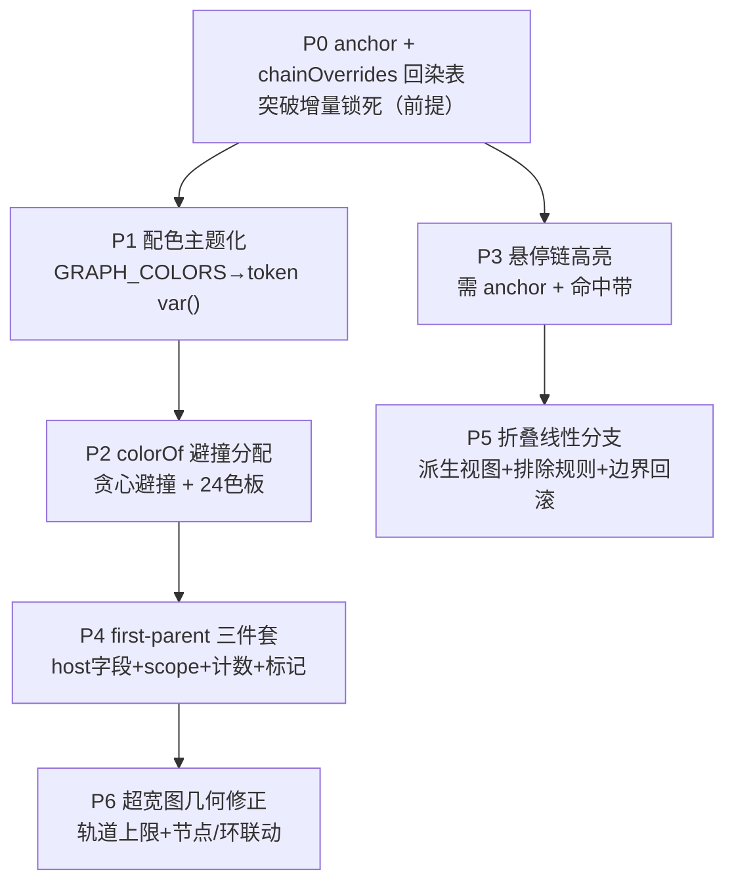

# Git 历史图谱增强 · 设计方案

> 分支 `feat/graph-enhancement`（基于 dev）。依据：`.wiki/docs/联网检索资料-IDEA中Git图谱设计.md` + 当前实现 `git-graph.ts`/`CommitRow.tsx` + 对抗性复审。

## 一、现状评估

| 维度 | 现状 | 评价 |
|---|---|---|
| 轨道分配 | 车道生命周期（wait/owner）、首父继承、多父开新车道、openLane 回收首 null、左对齐压缩 | ✅ 几何达 IDEA 水平 |
| 链色规则 | resolveChainColor：分支名锚定→子链继承→hash 兜底；owner 传播 | ⚠️ 语义偏差（见下） |
| 渲染 | SVG：竖线+节点圆+joins 水平线+edges 贝塞尔（0.4/0.6）+悬垂虚线+选中环 | ✅ 矢量平滑 |
| 悬垂诚实 | markFilterEnds 标注过滤下未解析延续线/副父 | ✅ 优于多数 |
| 增量 | createGraphBuilder 持车道末态，append 只处理新增 + CommitRow memo | ✅ 千条级不重渲 |
| 简化 | 无 | ⚠️ 缺失 |
| 配色 | 16 色 Material 500 硬编码 hex | ⚠️ 非主题 token |
| 交互 | 点击选中（环），无悬停高亮 | ⚠️ 可增强 |

## 二、复审发现（8 项）

| # | 论断 | 判定 | 核心问题 |
|---|---|---|---|
| 1 | 轨道达 IDEA 水平 | 几何成立/颜色偏离 | merge 第二父 owner=commit.hash→被合并分支染目标色非源色；tip-merge 无子→hash 随机色；remote-only ref 不锚定；增量不变量锁死回染 |
| 2 | 配色需改渲染 stroke→style | 有误（反了） | 实测现代 Chromium attribute 内 var() 可解析；零渲染改动 |
| 3 | 悬停高亮可行 | 低估 | laneHashes 渲染零消费；owner 段级非链 ID；16 色 6% 对撞；需 anchor + 命中带 |
| 4 | first-parent 跳过多父 | 修复不完整 | --all+--first-parent 不裁侧分支；需三件套：host 字段+scope+计数 |
| 5 | 折叠与增量冲突 | 定性过重 | 折叠=派生视图重建不碰色不变；真复杂度在边界回滚+排除规则 |
| 6 | colorOf 哈希差 | 结论对示例错 | 真碰撞是异序同和+mod16 生日界；修法=确定性避撞分配非换哈希 |
| 7 | 曲线 0.4/0.6 | 收益高估 | t=0.5 处与 0.5/0.5 的 y 相同；octopus 复用车道叠印未文档化 |
| 8 | 超宽图线宽联动 | 真问题在轨道上限 | laneW 停 8→24 列后 track 突破 192；选中环 r+3>laneW/2 侵入邻道 |

## 三、核心架构决策：chainOverrides 回染表 + anchor 字段

增量不变量"已渲染行色永不变"封死了 IDEA 式源色语义。修正——渲染层维护 `chainOverrides: Map<anchor, color>` 重写表：
- processCommit 的 memo 保留（增量色不变）；
- 侧链 ref 到达后只更新 chainOverrides（anchor→正确源色），渲染读色时叠加 override；
- 行对象不动，memo 语义保留，增量安全。

同时解决：tip-merge 随机色、remote-only ref 不锚定、被合并分支染源色。

## 四、实施路线（P0-P6）

| 优先级 | 内容 | 成本 | 收益 | 批次 |
|---|---|---|---|---|
| **P0** | anchor 字段 + chainOverrides 回染表 | 中 | 前提（解锁颜色+悬停+折叠） | 第一 |
| P1 | 配色主题化（token var()） | 低 | 高（视觉立现） | 第一 |
| P2 | colorOf 确定性避撞分配 | 中 | 中（减少碰撞） | 第一 |
| P3 | 悬停链高亮 | 中高 | 高（交互跃升） | 第二 |
| P4 | first-parent 三件套 | 中高 | 中 | 第二 |
| P5 | 折叠线性分支 | 高 | 高（里程碑） | 第二 |
| P6 | 超宽图几何修正 | 低 | 中 | 第二 |

### P0：anchor 字段 + chainOverrides 回染表

- resolveChainColor 的 memo 扩展为 `Map<hash, {color, anchor}>`，anchor 随继承传播；
- GraphRow 追加 `laneAnchors: Record<number, string>`（含 node/edge 的 anchor）；
- chainOverrides: `Map<anchor, color>`，侧链 ref 到达后更新，渲染读色叠加。

### P1：配色主题化

- GRAPH_COLORS 16 hex → `var(--dsg-graph-0..15)` token；
- styles/globals.ts 注入亮/暗两套 `--dsg-graph-*`（色相均匀、饱和 50-60%、明度 45-55%）；
- attribute 直接用 var()（实测可解析，零渲染改动）；
- 同步 fallback：colorOfLane/dotColorOf/searchDot 走 token。

### P2：colorOf 确定性避撞分配

- 用 HistoryTab 已有 branches/tags 查询喂全量分支名；
- colorOf 改贪心避撞：维护 `Map<name, colorIndex>`，探测冲突→换空色，耗尽回落 hash mod；
- 调色板 16→24 色（撞率降 ~1/3）。

### P3：悬停链高亮（第二批次）

- 悬停→设 hoveredAnchor；同 anchor 加粗 2.2、其余 opacity 0.35；
- 透明命中带（strokeWidth≈8, pointer-events:stroke）；
- 数据：laneAnchors（P0）。

### P4：first-parent 三件套（第二批次）

1. host GitQuery 加 firstParent?: boolean；
2. queries.ts：firstParent 时 git log --first-parent（弃 --all）+ rev-list --count --first-parent；
3. markFilterEnds first-parent 下不标悬垂。

### P5：折叠线性分支（第二批次）

- useMemo(fold(graphRows, depth)) 派生视图；
- 排除：merge/joins/edges/refs 行不折叠；
- 边界回滚：续载只重判尾部段；
- 保留 anchor + 悬垂端头语义。

### P6：超宽图几何修正（第二批次）

- 24 列后走横向滚动（不压 laneW<8）；
- laneW<10 时 nodeR=min(4,laneW/3)、选中环 r=min(nodeR+2,laneW/2-0.5)；
- 线宽保持 1.5。

## 五、与现状对齐结论

算法层（git-graph.ts）几何已达 IDEA 水平，无需重写。改动面：配色（GRAPH_COLORS/colorOf）、链色数据（anchor/chainOverrides）、渲染层（CommitRow 读色叠加 override + 命中带）、host 查询（first-parent）。P0 是解锁后续的前提，第一批次 P0+P1+P2 完成后，颜色质量与主题化基础就绪，P3-P6 在第二批次推进。
